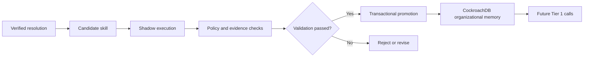
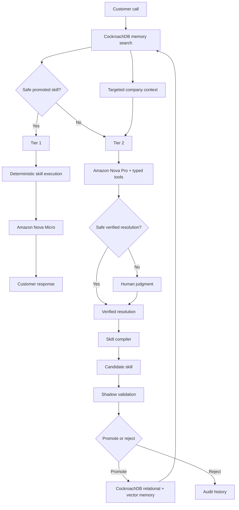

# Hive Call

> **The call center that learns from every resolved call.**

Hive Call is a self-learning AI contact center that uses CockroachDB organizational memory for known issues, stronger reasoning for novel issues, and human judgment when necessary. Every verified resolution can become a validated reusable capability, allowing future calls to take the cheaper path.

[**Open the live demo**](https://h0yzyuck8i.execute-api.us-east-1.amazonaws.com/demo)

## The idea

Most AI support systems start every request from scratch. Even when the company has already solved the same problem, the next agent pays for another full reasoning pass—or sends the issue to another person.

Hive Call follows a different principle:

> **Spend intelligence only where the company has not already learned the answer.**

Known problems execute validated procedures from CockroachDB. Novel problems receive stronger model reasoning. Ambiguous or unsafe problems remain human work. Once a resolution is verified, Hive Call can turn it into a bounded skill, validate it, persist it, and safely reuse it on a later call—without retraining the foundation model.

## Progressive intelligence

| Tier | When it runs | How it resolves the call |
| --- | --- | --- |
| **Tier 1 — Known territory** | A promoted skill safely matches the case | CockroachDB retrieval → deterministic skill execution → Amazon Nova Micro response |
| **Tier 2 — Unknown territory** | No promoted skill safely applies | Targeted CockroachDB context → Amazon Nova Pro investigation and typed tools |
| **Tier 3 — Human judgment** | Tier 2 cannot verify a safe resolution | Evidence-rich human handoff → verified resolution → the same learning pipeline |

### Tier 1: Known territory

When a promoted skill safely matches the current case, Hive Call:

1. retrieves the validated skill from CockroachDB;
2. executes its bounded deterministic procedure against customer state;
3. sends only the resulting verified facts to Amazon Nova Micro; and
4. asks Nova Micro to render the natural customer-facing response.

The exact model is **Amazon Nova Micro** (`amazon.nova-micro-v1:0`). Nova Micro is not the business reasoner: the validated skill and deterministic tools have already produced the authoritative resolution.

### Tier 2: Unknown territory

When no promoted skill safely applies, Hive Call:

1. retrieves targeted company context, policies, related verified cases, and customer state from CockroachDB;
2. gives that bounded context and typed tools to Amazon Nova Pro; and
3. lets Nova Pro investigate the novel problem and attempt a verified resolution.

The exact model is **Amazon Nova Pro** (`amazon.nova-pro-v1:0`).

### Tier 3: Human judgment

If Tier 2 cannot verify a safe resolution, Hive Call escalates to a human with:

- the conversation and customer issue;
- evidence and tools already checked;
- relevant company context; and
- the exact reason for escalation.

A verified human resolution can later enter the same learning pipeline as a model-assisted resolution. Hive Call does not assume every support issue should become autonomous: fraud, policy exceptions, high-impact decisions, and ambiguous cases can remain human work.

## The learning loop

> **verified resolution → candidate skill → shadow execution → policy/evidence checks → transactional promotion → future Tier 1**



### A skill is not a cached answer

A learned skill is a bounded declarative procedure containing:

- applicability conditions;
- required customer and company context;
- typed tool steps;
- deterministic calculations and assertions;
- policy dependencies;
- allowed response facts;
- escalation conditions;
- source-case lineage; and
- evaluation and promotion history.

Generated arbitrary code is never executed. A model can propose a candidate skill, but it cannot promote its own output. Promotion occurs only after the proposed procedure executes against shadow cases and passes the required oracle, policy, and evidence checks.

## Guided four-call demo

The important demonstration is not simply that Hive Call answers four calls. It learns a capability during the demo, persists that capability in CockroachDB, and reuses it on a later call.

### Call A — Known territory

A customer reports a late shipment. Hive Call retrieves an existing promoted skill from CockroachDB, executes it deterministically, and asks Nova Micro to render the verified facts conversationally.

- Full reasoning-model calls: **0**
- Human escalations: **0**

### Call B — Novel but solvable

A customer asks why a $60 item produced only a $43 refund. No promoted skill safely applies.

Nova Pro receives only the relevant order, refund, promotion, policy, company context, and typed tools. After resolving the case, the verified trace becomes a candidate skill. The procedure executes against six shadow cases, passes policy and evidence validation, and becomes eligible for promotion.

### Call C — Human judgment

A partial bundle return with mixed tender creates an ambiguous refund. Tier 1 has no safe match. Nova Pro investigates but cannot verify a safe resolution inside its policy boundary, so Hive Call escalates to a human.

The verified human resolution is compiled into another candidate skill and validated through the same shadow-execution pipeline.

### Call D — The payoff

A different customer presents a differently worded instance of the problem learned from Call C. CockroachDB retrieves the newly promoted skill, and the call now resolves through Tier 1 using Nova Micro.

- Previously required human judgment
- Now resolved from learned organizational memory
- Full reasoning-model calls: **0**
- Human escalations: **0**

## How CockroachDB powers Hive Call

CockroachDB is not merely a transcript database. It is the authoritative persistent organizational-memory layer that changes how future calls execute.

### 1. Learned resolution memory

CockroachDB stores:

- candidate, promoted, degraded, deprecated, rejected, and superseded skill versions;
- source calls and verified resolutions;
- tool traces and outcome evidence;
- policy dependencies and versions;
- shadow evaluations;
- promotion and demotion events;
- model and token telemetry; and
- memory reads and audit lineage.

A Tier 1 skill is eligible only when it is promoted, tenant-compatible, policy-compatible, and applicable to the current case.

### 2. Company context memory

CockroachDB also stores the context Tier 2 may need:

- product information and plans;
- billing rules and refund policies;
- procedures and documentation;
- customer state; and
- related verified cases.

Nova Pro receives targeted retrieved context—not the entire company database.

### Distributed Vector Indexing

Hive Call uses real `VECTOR(1024)` embeddings and three CockroachDB distributed vector indexes:

- `skill_embedding_idx`
- `call_embedding_idx`
- `company_context_embedding_idx`

Embeddings are generated by **Amazon Titan Text Embeddings V2** (`amazon.titan-embed-text-v2:0`).

Vector similarity is only the first retrieval stage. A semantically similar skill is not automatically allowed to execute. After vector retrieval, Hive Call performs structured checks for:

- tenant compatibility;
- promotion state;
- policy compatibility;
- required context; and
- applicability to the current case.

Tier 1 intentionally optimizes for precision. A missed match costs a Nova Pro reasoning call; a false match can produce an incorrect customer answer.

### CockroachDB Cloud Managed MCP Server

Hive Call uses the **CockroachDB Cloud Managed MCP Server** as a separate, read-only inspection path into live organizational memory.

The application persists evidence from a real Managed MCP lookup so the System Proof experience can independently demonstrate the live memory layer instead of relying only on the application's normal SQL query path. The separate Lambda-side MCP proxy is not claimed as verified proof.

### Transactional learning

Concurrent calls may propose overlapping skills. Promotion, supersession, demotion, and resolution finalization therefore use retryable, transactional, idempotent CockroachDB writes so organizational memory remains consistent under concurrency and retries.

## AWS architecture



| Service | Role in Hive Call |
| --- | --- |
| **Amazon Bedrock — Amazon Nova Micro** (`amazon.nova-micro-v1:0`) | Tier 1 conversational renderer. It receives only selected promoted-skill data, verified facts, the authoritative resolution, the current issue, and response constraints. |
| **Amazon Bedrock — Amazon Nova Pro** (`amazon.nova-pro-v1:0`) | Tier 2 reasoning, typed tool use, investigation, and bounded candidate-skill compilation. |
| **Amazon Titan Text Embeddings V2** (`amazon.titan-embed-text-v2:0`) | Generates 1024-dimensional embeddings for calls, skills, and company context. |
| **Amazon Polly** | Generates customer-facing speech with the Ruth voice and generative engine. |
| **AWS Lambda** | Runs the deployed Next.js API and agent workflows. |
| **Amazon API Gateway** | Exposes the public application and API surface. |
| **Amazon S3** | Stores sanitized, content-addressed voice artifacts privately with encryption and lifecycle expiry. |
| **Amazon CloudWatch** | Captures runtime logs, model/token metrics, latency, escalation metrics, rate-limit events, alarms, and dashboards. |
| **AWS Secrets Manager** | Stores external database and MCP credentials outside the codebase. |
| **AWS CDK** | Defines and deploys the AWS infrastructure. |

## Production and safety boundaries

Hive Call treats learned organizational memory as an execution system, so reuse is gated by explicit controls:

- Only promoted skills can execute through Tier 1.
- Learned skills conform to a typed schema and bounded declarative DSL.
- Generated arbitrary code is never executed.
- Shadow validation executes the proposed procedure rather than only comparing semantic similarity.
- Oracle-fact and policy assertions verify procedure behavior.
- Nova Micro output is checked against authoritative Tier 1 facts.
- Policy versions are linked to learned skills.
- Degraded skills are removed from Tier 1 eligibility.
- Promotion and resolution finalization are transactional and idempotent.
- Runtime-reader and reviewer APIs use separate roles.
- Unauthenticated protected-memory access is rejected.
- Bedrock and Titan calls use bounded timeouts.
- Expensive public demo routes use CockroachDB-backed rate limits plus API Gateway throttling.
- Polly audio is reused from private S3 instead of being regenerated unnecessarily.
- CloudWatch records requests, model calls and tokens, latency, human escalation, and avoided full-reasoning calls.

These controls do not imply that every support issue should become autonomous. Fraud, policy exceptions, high-impact decisions, and ambiguous cases can remain human work.

## What makes Hive Call different

- A **knowledge base** remembers information.
- **Transcript search** remembers conversations.
- A normal **AI support agent** reasons about the current request.
- **Hive Call** remembers how a verified problem was resolved, when that resolution is valid, what evidence supports it, and how a future agent can execute it safely.

The system improves its economics without retraining the foundation model. It spends stronger intelligence on genuinely new territory and reuses validated organizational capability everywhere else.

## Technology stack

- CockroachDB Cloud
- CockroachDB Distributed Vector Indexing
- CockroachDB Cloud Managed MCP Server
- Amazon Bedrock
- Amazon Nova Micro
- Amazon Nova Pro
- Amazon Titan Text Embeddings V2
- AWS Lambda
- Amazon Polly
- Amazon S3
- Amazon API Gateway
- Amazon CloudWatch
- AWS Secrets Manager
- AWS CDK
- Next.js 16
- React
- TypeScript
- Zod
- SQL
- Vector search

## Run locally

```bash
npm install
npm run dev
```

Open `http://localhost:3000/demo`. Run the full validation suite with:

```bash
npm run check
```

The default local provider is deterministic. The deployed path uses the AWS models and services described above; environment names and safe placeholders are documented in `.env.example`.

## Scope and limitations

- The demo uses fictional Northstar Commerce customer, order, shipment, promotion, subscription, and refund data.
- The web application simulates contact-center calls and human handoff.
- Hive Call does not claim production telephony integration.
- It does not claim a real customer deployment.
- It does not claim measured dollar savings.
- It does not claim 99% autonomous coverage.
- Evaluation results describe synthetic demo fixtures and held-out cases, not production customer performance.

The submitted result is specifically the learning loop:

> **resolve once → validate the procedure → persist it in CockroachDB → let the next agent spend less intelligence solving it**

## License

Licensed under the [Apache License 2.0](LICENSE). All customers and transactions in the demo are fictional.
